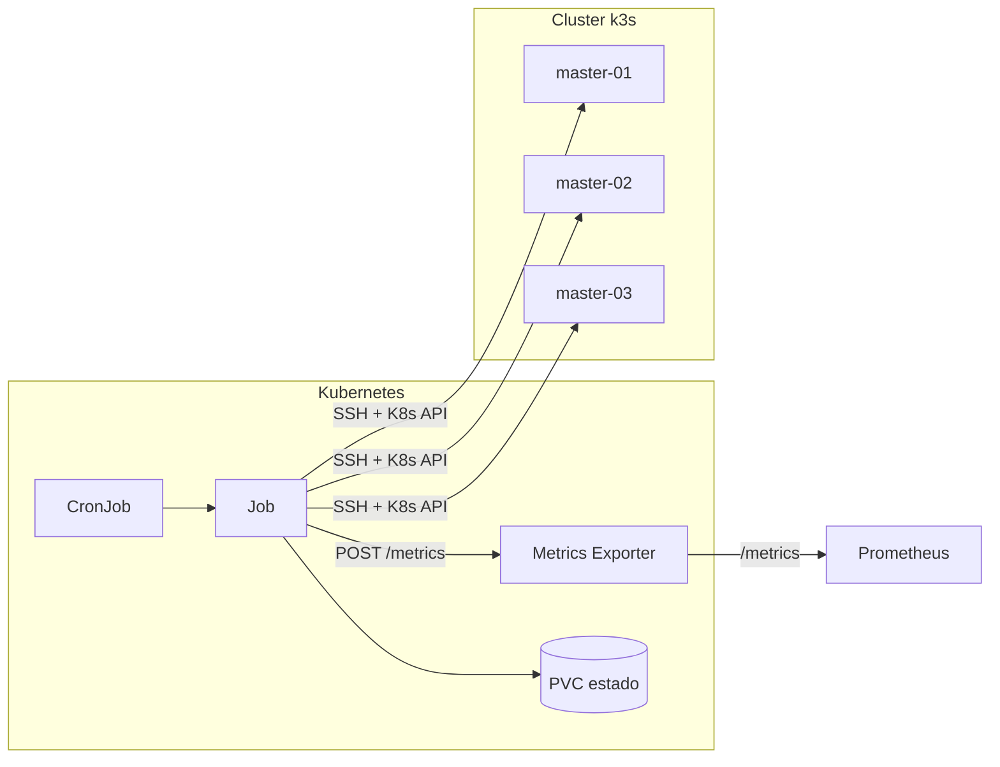

# Doctor-ku

[](LICENSE)
[](https://www.python.org/downloads/)
[](https://github.com/ghcetraro/doctor-ku/actions/workflows/ci.yml)
[](helm/Chart.yaml)
[](https://k3s.io/)

**Monitor y remediador automático de clusters k3s** — escrito en Python, pensado para Kubernetes.

Doctor-ku vigila tus nodos k3s por SSH y la API de Kubernetes. Cuando detecta fallos sostenidos, puede **reinstalar y reincorporar nodos** de forma automática, con métricas Prometheus y ejecución programada vía CronJob.


---

## El problema

En clusters k3s bare-metal o on-premise, un nodo que queda `NotReady` o desaparece del cluster suele requerir intervención manual:

- SSH al servidor
- Limpiar estado de etcd
- Reinstalar k3s con la versión correcta
- Verificar que el nodo vuelva a `Ready`

Eso escala mal y ocurre fuera de horario.

## La solución

Doctor-ku automatiza ese ciclo:

1. **Monitorea** SSH, servicio k3s y estado `Ready` en Kubernetes
2. **Acumula fallos** entre ejecuciones (estado persistente)
3. **Remedia** cuando se supera el umbral configurado
4. **Expone métricas** para Prometheus/Grafana
5. **Corre como CronJob** — cada chequeo es un Job aislado, ejecutable también a mano



---

## Características

| Área | Detalle |
|------|---------|
| **Monitoreo** | SSH, `systemctl` k3s, condición `Ready` del nodo |
| **Remediación** | Uninstall, limpieza, reinstall vía `get.k3s.io`, alineación de versión |
| **Alta disponibilidad** | Limpieza de miembros etcd fantasma en masters |
| **Estados especiales** | Nodos `missing` (ausentes del cluster) también se remedian |
| **Observabilidad** | Métricas `doctorku_*`, exporter persistente, compatible con Grafana |
| **Despliegue** | Helm chart, CronJob + PVC, historial de 3 jobs OK/fallidos |
| **Seguridad** | Claves SSH fuera del repo (`secrets.yaml` local o External Secrets) |

---

## Limitaciones y disclaimer

Doctor-ku **no es un sustituto de un operador humano** en todos los escenarios. Tené en cuenta:

- **Remediación destructiva**: desinstala k3s, borra `/var/lib/rancher/k3s` y reinstala. Podés perder estado local del nodo si no está respaldado.
- **Solo k3s**: probado con flujo `get.k3s.io` / RKE2-compatible. No cubre EKS, GKE, AKS ni otros distros sin adaptar scripts.
- **SSH obligatorio**: requiere acceso root (o sudo) a cada nodo monitorizado.
- **Un nodo por ciclo** (`max_nodes_per_cycle: 1` por defecto): evita remediar todo el cluster a la vez, pero un fallo masivo puede tardar varios ciclos.
- **Quorum etcd**: la limpieza de miembros fantasma ayuda, pero un cluster ya sin quorum puede necesitar intervención manual.
- **Sin garantía de SLA**: software open source “as is”; probá en staging con `dry_run: true` antes de producción.

Recomendación: empezá con `remediation.dry_run: true` y revisá logs/métricas antes de habilitar remediación real.

---

## Stack

- **Python 3.12** · FastAPI · APScheduler · prometheus-client
- **Paramiko** (SSH) · kubernetes client · httpx
- **Helm** · Kubernetes CronJob · PVC
- **k3s** / RKE2-compatible install flow

---

## Inicio rápido

### Requisitos

- Python 3.12+
- Acceso SSH a los nodos del cluster
- Un nodo sano con kubeconfig y token k3s
- Kubernetes (opcional, para despliegue del CronJob)

### Local

```bash
cp config/clusters.example.yaml config/clusters.yaml
# Editar nodos, hosts y credenciales SSH en ./secrets/ssh/

python -m venv .venv && source .venv/bin/activate
pip install -r requirements.txt
python -m app.runner
```

> **Nota:** `.venv/` está en `.gitignore` — no lo commitees.

### Docker

```bash
cp config/clusters.example.yaml config/clusters.yaml
docker compose run --rm doctor-ku python -m app.runner
```

Imagen publicada: ver [docs/container-image.md](docs/container-image.md).

### Kubernetes (Helm)

```bash
cp helm/secrets.example.yaml helm/secrets.yaml
# Completar helm/secrets.yaml con tu clave SSH (NO commitear)

helm upgrade --install doctor-ku ./helm \
  -f helm/values-production.yaml \
  -f helm/secrets.yaml \
  -n doctor-ku --create-namespace
```

Ejecución manual:

```bash
kubectl -n doctor-ku create job doctor-ku-manual-$(date +%s) \
  --from=cronjob/doctor-ku
```

---

## Configuración

Archivo principal: `config/clusters.yaml` (ver `config/clusters.example.yaml`).

Parámetros clave de remediación:

```yaml
remediation:
  enabled: true
  failure_threshold: 2      # ciclos consecutivos antes de remediar
  max_nodes_per_cycle: 1    # evita remediar todo el cluster a la vez
  dry_run: false
```

CronJob (Helm):

```yaml
cron:
  schedule: "0 */6 * * *"
  successfulJobsHistoryLimit: 3
  failedJobsHistoryLimit: 3
```

---

## Métricas

El CronJob publica métricas al exporter. Prometheus scrapea `/metrics`:

- `doctorku_ssh_up` · `doctorku_k3s_up` · `doctorku_node_ready`
- `doctorku_failure_streak` · `doctorku_remediation_total`
- `doctorku_last_run_success` · `doctorku_last_run_timestamp_seconds`

---

## Documentación

- [Despliegue en Kubernetes](docs/despliegue.md)
- [Remediación de nodos](docs/remediacion-nodos.md)
- [Imagen de contenedor (GHCR)](docs/container-image.md)
- [Versionado y releases](docs/releases.md)
- [Presentación / LinkedIn](docs/PRESENTACION.md)
- [Speech para LinkedIn](docs/speech-linkedin.md)
- [Changelog](CHANGELOG.md)
- [Contribuir](CONTRIBUTING.md)

---

## Seguridad

**No commitees claves SSH, tokens ni kubeconfig.** Usa `helm/secrets.yaml` (gitignored) o un gestor de secretos (External Secrets, Sealed Secrets, Vault).

Ver [SECURITY.md](SECURITY.md).

---

## Licencia

[MIT](LICENSE) — Copyright (c) Gabriel Cetraro

---

## Autor

Proyecto open source de **Gabriel Cetraro** — automatización de infraestructura, Kubernetes y observabilidad.

Si te resulta útil, ⭐ en GitHub ayuda a darle visibilidad.
